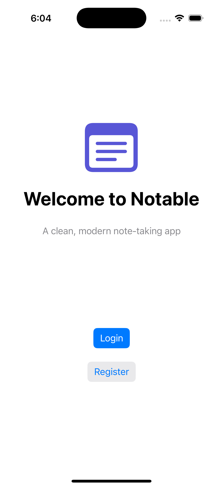
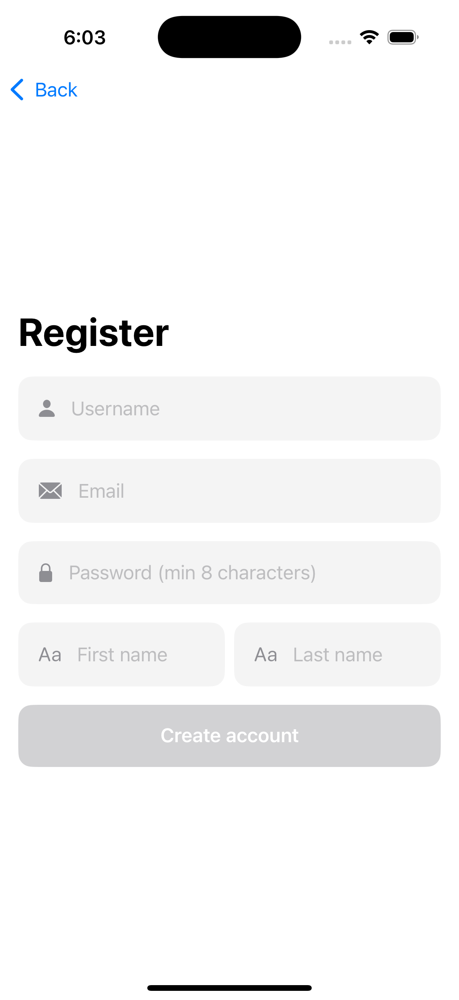
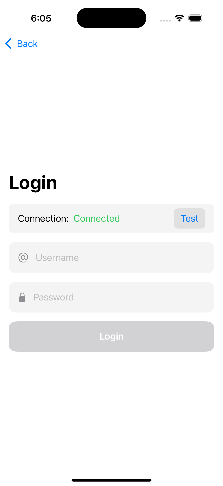
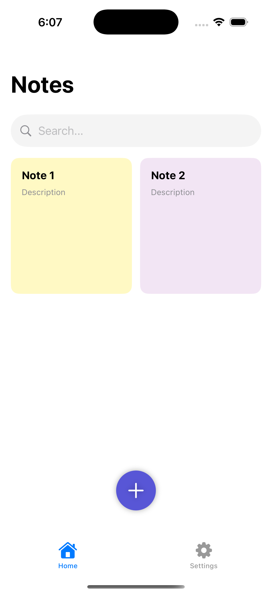
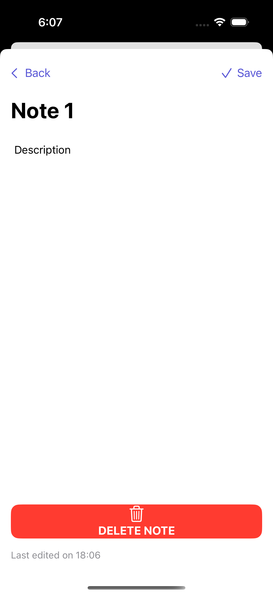
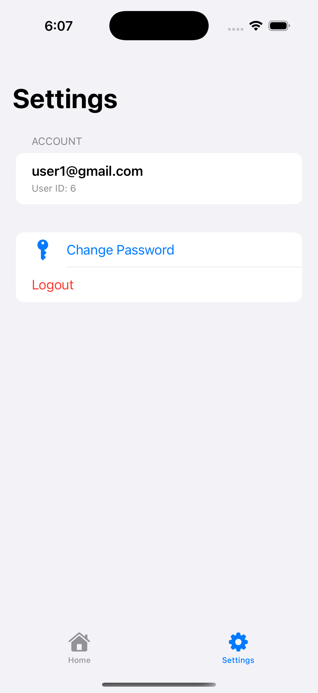

# SimpleNote — iOS Notes App

[](LICENSE)
[]()

**A polished, lightweight iOS client for the SimpleNote backend** — designed for clarity, fast note taking, and easy integration with a REST API backend (supports pagination, search, authentication with refresh tokens).

---

## Table of Contents

* [Features](#features)
* [Screenshots](#Gallary)
* [Tech & Architecture](#tech--architecture)
* [Requirements](#requirements)
* [Getting started](#getting-started)

  * [Clone](#clone)
  * [Install dependencies](#install-dependencies)
  * [Open in Xcode](#open-in-xcode)
  * [Run on Simulator / Device](#run-on-simulator--device)
* [Configuration (Environment / API)](#configuration-environment--api)
* [API & Postman](#api--postman)
* [Contributing](#contributing)
* [Roadmap](#roadmap)
* [Troubleshooting](#troubleshooting)
* [License](#license)
---

## Features

* User signup / login (JWT + refresh token refresh flow)
* View notes list (server-side pagination)
* Search notes (server search endpoint)
* Create / Edit / Delete notes
* View note details
* Profile screen & logout
* Clean MVVM-like structure, reusable network client

---

**Gallery**


<div align="center">
  <table>
    <tr>
      <td></td>
      <td></td>
      <td></td>
    </tr>
    <tr>
      <td align="center">Home</td>
      <td align="center">Notes list</td>
      <td align="center">Note detail</td>
    </tr>
  </table>
</div>

<div align="center">
  <table>
    <tr>
      <td></td>
      <td></td>
      <td></td>
    </tr>
    <tr>
      <td align="center">Home</td>
      <td align="center">Notes list</td>
      <td align="center">Note detail</td>
    </tr>
  </table>
</div>


---

## Tech & Architecture

* Language: Swift
* UI: UIKit / SwiftUI (project-dependent — inspect `Sources/`)
* Dependency manager: Swift Package Manager or CocoaPods
* Networking: URLSession (or Alamofire if present) with token refresh middleware
* Architecture: MVVM / Clean-ish separation (Controllers, ViewModels, Services)

---

## Requirements

* macOS with Xcode (recommend latest stable or Xcode 14+)
* iOS 14+ (verify in project `Deployment Target`)
* CocoaPods (if used) or SPM

---

## Getting started

### Clone

```bash
git clone https://github.com/kasrahmi/Notable-ios.git
cd Notable-ios
```

### Install dependencies

If the repo uses CocoaPods:

```bash
pod install
```

If it uses SPM, Xcode resolves packages automatically when opening the project.

### Open in Xcode

If CocoaPods is used, open the workspace:

```bash
open Notable.xcworkspace
```

Otherwise open the project:

```bash
open Notable.xcodeproj
```

### Run on Simulator / Device

1. Select a simulator or your device in Xcode.
2. Choose the app scheme (e.g. `Notable`).
3. Press `⌘R` to build & run.

---

## Configuration (Environment / API)

Create or update the configuration to point to the backend API.

Common environment variables (or constants in the app):

* `API_BASE_URL` — e.g. `https://simple-note.amirsalarsafaei.com`
* `API_TIMEOUT` — network timeout in seconds
* `CLIENT_ID` / `CLIENT_SECRET` — if backend requires

> Note: For local testing you can run the backend (link in project description) or point the app to a staging server.

---

## API & Postman

The backend provides OpenAPI/Redoc documentation and a Postman importable collection:

`https://simple-note.amirsalarsafaei.com/api/schema/redoc/`

Example `curl` requests:

**Login**

```bash
curl -X POST "https://simple-note.amirsalarsafaei.com/api/auth/login/" \
  -H 'Content-Type: application/json' \
  -d '{"username":"you@example.com","password":"password"}'
```

**Get notes (paginated)**

```bash
curl -H "Authorization: Bearer <access_token>" \
  "https://simple-note.amirsalarsafaei.com/api/notes/?page=1&page_size=20"
```

You can download the Postman collection from the Redoc page (there is an option to export/import). Import that collection into Postman for quick API testing.

---

## Contributing

Contributions are welcome! Please follow these steps:

1. Fork the repository.
2. Create a feature branch: `git checkout -b feat/awesome-feature`
3. Commit your changes: `git commit -m "Add amazing feature"`
4. Push to your fork and open a Pull Request.

Include in PR description:

* What changed
* Why it changed
* Any migration or environment steps

---

## Roadmap

Planned improvements:

* Offline caching & local persistence
* Rich text support for notes
* Image attachments in notes
* Share / export notes

---

## Troubleshooting

**App crashes on launch**

* Clean build folder: `⌘⇧K` and rebuild.
* Check that `API_BASE_URL` is correctly set (no malformed URL).

**Network errors / 401 Unauthorized**

* Ensure the access token is being saved and included in `Authorization` header.
* Verify refresh token flow is implemented and refreshing tokens when access token expires.

---

## License

This project is released under the MIT License. See [LICENSE](LICENSE) for details.
